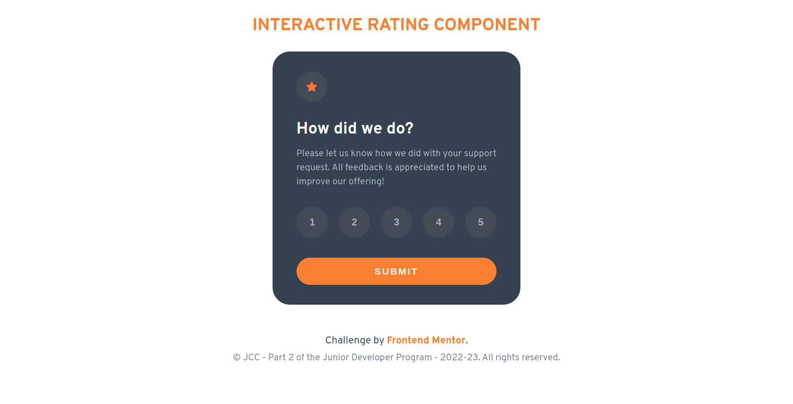
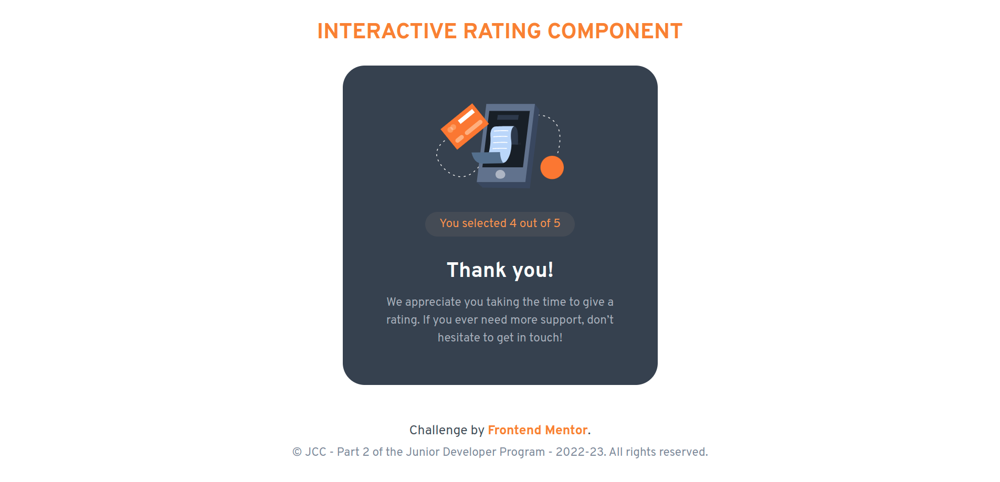

<div style="display: flex; justify-content: space-between; align-items: baseline;">
    
    <h2 style="text-align: left; text-decoration: none; background: none; border-radius: 0; border: none; box-shadow: none; color: #4B5563; font-size: 18px; font-weight: 500; padding-left: 0; margin-top: 10px; text-transform: uppercase">JDP - Part 2 Fullstack JavaScript</h2>
    
</div>
<h2 style="text-align: center;  margin-bottom: 30px;">Build An Interactive Rating Card - React States & Components</h2>

<small>Due Date: <strong>1st May, 2023 23:59:59</strong></small>

1. Using React, build an **Interactive Rating Card** from this HTML markup.
   
   ```html
   <main>
      <h1>Interactive Rating Component</h1>
      <div class="card">
        <div class="rating-container">
          <div class="star-icon-wrapper">
            
          </div>

          <h3>How did we do?</h3>

          <p>
            Please let us know how we did with your support request. All
            feedback is appreciated to help us improve our offering!
          </p>

          <div class="buttons">
            <button>1</button>
            <button>2</button>
            <button>3</button>
            <button>4</button>
            <button>5</button>
          </div>

          <div class="submit-button-wrapper">
            <button class="submit">Submit</button>
          </div>
        </div>

        <div class="rating-feedback-container">
          

          <div class="rating-result">
            You selected <span id="rating">0</span> out of 5
          </div>

          <h3>Thank you!</h3>

          <p>
            We appreciate you taking the time to give a rating. If you ever need
            more support, don’t hesitate to get in touch!
          </p>
        </div>
      </div>
    </main>
   ```

   Both the above HTML markup and its styles (CSS) are provided in the assignment's resources folder in **interactive-rating-card-HTML-CSS**. Please convert it to **JSX** to quickly build and design your Card UI.

2. Your users should be able to:
   1. Select and submit a number rating like below
    
        
   
   2. See the "Thank you" card state after submitting a rating like below:

        


<div style="page-break-after: always"></div>

Here are some hints and pointers:

- You may have at least one component called **RatingCard** with at least these states:
      
    1. **status** - keep track of the status of the card. One can say your card **status** is in **idle** state when it's not submitted, and in **submitted** state when it's submitted.
     
        You can also use this **status** state to show the "Thank you" messsage when the card is submitted, otherwise show the rating content as the default UI.
      
    
    2. A **rating** state. This state will hold the value of the selected rating button. This state is also displayed in the rating result's UI ("Thank you" message) after the rating is submitted. 
    
    
<div style="margin-top: 30px"></div>


**Feel free to have any number of components and states as long as they make sense to you.**


<div style="margin-top: 50px"></div>


By Omar Jasseh<br />
Course Instructor